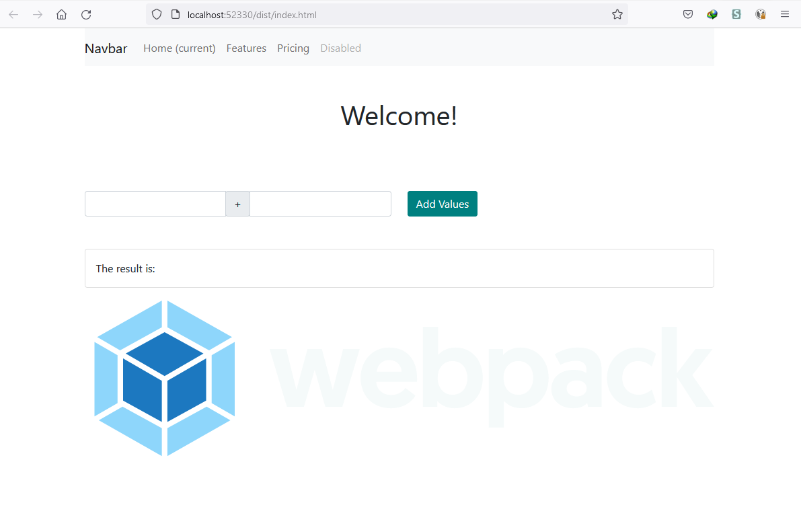
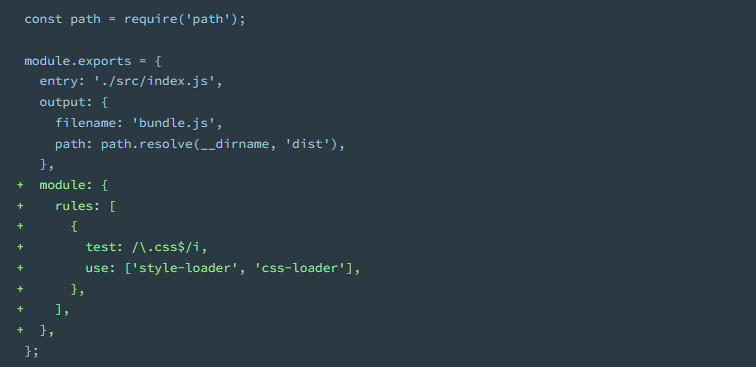
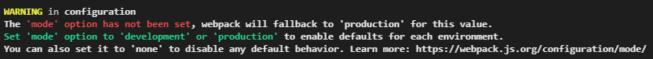

# Install

## Basic Setup

Στο παράδειγμα έχουμε μια html σελίδα με ένα μίνι calculator που προσθέτει δύο αριθμούς:    
O στόχος είναι να έχουμε τα script χωρισμένα σε ξεχωριστά αρχεία που το κάθε ένα εκθέτει    
μεθόδους ή μεταβλητές, διαθέτοντας μια αυτόνομη λειτουργρία και ενσωματώνοντας ότι resource    
είναι αναγκαίο για αυτό τον σκοπό, αλλά στο τέλος θέλουμε ένα μηχανσιμό που να πάρει όλα τα    
αναγκαία στοιχεία (css,images,html templates) και να τα ενσωματώσει σε όσο το δυνατόν    
λιγότερες βιβλιοθήκες είναι δυνατόν.



## Εκκίνηση
- Δημιουργούμε το αρχείο packag.json  που θα κρατά όλες τις αναφορές σε άλλες βιβλιοθήκες, 
  καθώς και τις βασικές ρυθμίσεις της εφαρμογής μας.

  `npm init`

  και να απαντάμε στις αρχικές ερωτήσεις για το project.

- Εγκαθιστούμε την βιβλιοθήκη **webpack** και την **webpack cli**

  `npm install webpack webpack-cli --save-dev`


- Το package.json, με αλλαγμένο το path για την main 

  από `"main": "index.js",` 

  σε `"main": "./src/index.js",`:

```json
{
  "name": "myfirstwebpackapp.2",
  "version": "1.0.0",
  "description": "`nmp install webpack --save-dev`",
  "main": "./src/index.js",
  "scripts": {
    "test": "echo \"Error: no test specified\" && exit 1"
  },
  "author": "",
  "license": "ISC",
  "devDependencies": {
    "webpack": "^5.70.0",
    "webpack-cli": "^4.9.2"
  }
}
```
- Εγκαθιστούμε όλες τις αναγκαίες βιβλιοθήκες τοπικά
στο directory ***node_modules***

- Εγκαθιστούμε το css framework bootstrap
`npm install bootstrap`
  και λόγω του ότι θα εγκατασταθεί η bootstrap 5    
  έχει εξάρτηση από την **`@popperjs/core`**     

- Εγκαθιστούμε και αυτή την εξάρτηση με την εντολή:
  `npm install @popperjs/core --save`

- Εκτελούμε ξανά την εντολή
`npm install`

- προσθέστε το αρχείο ***webpack.config.js***

- προσθέστε το ***build** script στο **package.json*** αρχείο.
   `"build": "webpack"`
```js
{
  "name": "myfirstwebpackapp.2",
  "version": "1.0.0",
  "description": "`nmp install webpack --save-dev`",
  "main": "./src/index.js",
  "scripts": {
    "test": "echo \"Error: no test specified\" && exit 1",
    "build": "webpack"
  },
  "author": "",
  "license": "ISC",
  "devDependencies": {
    "webpack": "^5.70.0",
    "webpack-cli": "^4.9.2"
  },
  "dependencies": {
    "bootstrap": "^5.1.3"
  }
}
```
- προσθέτουμε τους **loaders** για τα **css** και **scss**


και λόγω του ότι χρεισιμοποιούμε sass scss preprocesor  
χρειαζόμαστε και τον **sass-loader** loader, με την εξής σειρά:

`npm install --save-dev style-loader`

`npm install --save-dev css-loader`

`npm install sass-loader sass webpack --save-dev`

αλλάζουμε το webpack.config ως εξής

```js
test: /\.s[ac]ss$/i,
use: [
  // Creates `style` nodes from JS strings
  "style-loader",
  // Translates CSS into CommonJS
  "css-loader",
  // Compiles Sass to CSS
  "sass-loader",
],
```

Τώρα τρέχουμε την εντολή `npm run build`  
Το αρχείο main.js δημιουργήθηκε σωστά στον φάκελο **dir**  
αλλά έχουμε μια προειδοποίηση στο terminal.



για να το διορθώσουμε αυτό έχουμε δύο επιλογές:  

#### 1η Επιλογή
Αλλάζουμε στο package.json την εντολή build  
από `"build": "webpack"` σε `"build": "webpack --mode production"`

#### 2η Επιλογή, προτεινόμενη
Προσδιορίζουμε το property mode ως production ή development  
στο αρχείο webpack.config.js, ως εξής:

```js
module.exports = {
  entry: './src/index.js',
  mode: "production", // "production" | "development" | "none"
  output: {
    filename: 'main.js',
    path: path.resolve(__dirname, 'dist')
  },
```
μέχρι τώρα το αποτέλεσμα είναι ένα συμπιεσμένο αρχείο main.js
δεν υπάρχει καθόλου html, εμείς όμως θέλουμε το template.html  
στην τελική έξοδο.

Πρέπει λοιπόν να εξάγουμε και το template.html, για τον σκοπό αυτό  
χρειαζόμαστε ένα ακόμη loader που να μπορεί να το κάνει αυτό τον html-loader

`npm install --save-dev html-loader`

και το wp.conf είναι πλέον έτσι

```js
 module: {
    rules: [
      {
        test: /\.html$/,
        use: ['html-loader']
      },
      {
        test: /\.s[ac]ss$/i,
        use: [
          // Creates `style` nodes from JS strings
          'style-loader',
          // Translates CSS into CommonJS
          'css-loader',
          // Compiles Sass to CSS
          'sass-loader'
        ]
      }
    ]
  }
```  

### HtmlWebpackPlugin

The HtmlWebpackPlugin simplifies creation of HTML files to serve your webpack bundles. This is especially useful for webpack bundles that include a hash in the filename which changes every compilation. You can either let the plugin generate an HTML file for you, supply your own template using lodash templates, or use your own loader.

**`npm install --save-dev html-webpack-plugin`**

```js
const path = require('path');
var HtmlWebpackPlugin = require('html-webpack-plugin');

module.exports = {
  entry: './src/index.js',
  mode: 'development', // "production" | "development" | "none"
  output: {
    filename: 'main.js',
    path: path.resolve(__dirname, 'dist')
  },
  module: {
    rules: [
      {
        test: /\.html$/,
        use: ['html-loader']
      },
      {
        test: /\.s[ac]ss$/i,
        use: [
          // Creates `style` nodes from JS strings
          'style-loader',
          // Translates CSS into CommonJS
          'css-loader',
          // Compiles Sass to CSS
          'sass-loader'
        ]
      }
    ]
  }
};
```

και 
```js
      {
        test: /\.svg$/,
        type: 'asset/resource',
        generator: {
          filename: 'images/icons/[hash][ext]'
        }
      },
```
ή για να βάλουμε κάποιους τύπου εικόνων inline

`npm install svgo-loader --save-dev`
και
```js
      {
        test: /\.svg$/,
        type: 'asset/inline',
        use: 'svgo-loader'
      },
```
για τις άλλες εικόνες

```js
      {
        test: /\.(png|jpg|gif)$/,
        type: 'asset/resource'
      }
```      
